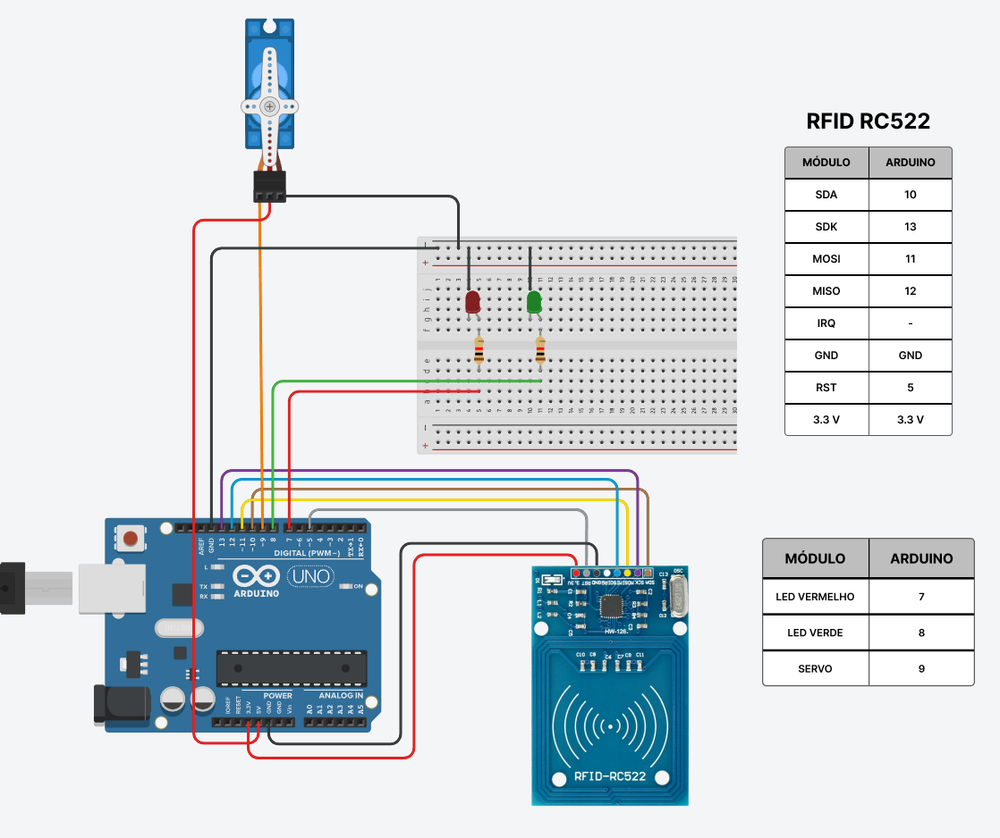

# Arduino - Portaria de condomínio

## Sobre o projeto

Este é um projeto feito em Arduino, utilizando um micro servo motor e um módulo RFID RC522 para simular uma portaria de condomínio.

## Portas e conexões

